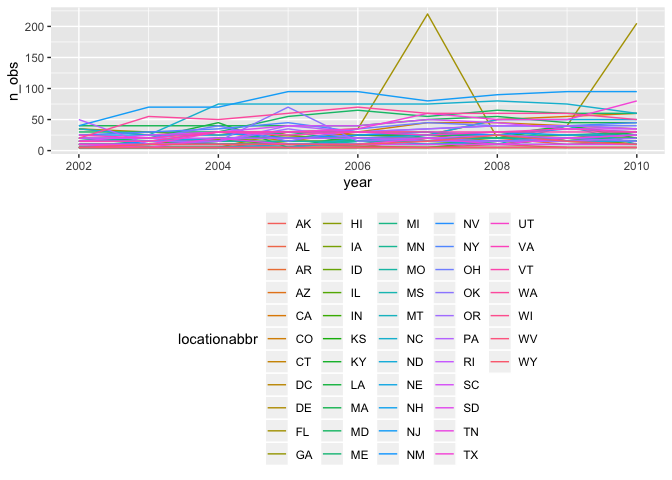

p8105\_hw3\_tm2680
================
Tatini Mal-Sarkar
10/4/2018

Problem 1
=========

``` r
library(p8105.datasets)
brfss_data = brfss_smart2010 %>% 
  janitor::clean_names() %>% 
  filter(topic == "Overall Health") %>% 
  select(-class, -topic, -question, -data_value_footnote_symbol:-respid) %>% 
  mutate(response = factor(response, levels = c("Poor", "Fair", "Good", "Very good", "Excellent"))) 
```

``` r
brfss_data %>% 
  filter(year == 2002) %>% 
  group_by(locationabbr) %>% 
  summarize(n = n_distinct(geo_location)) %>% 
  filter(n >= 7)
```

    ## # A tibble: 6 x 2
    ##   locationabbr     n
    ##   <chr>        <int>
    ## 1 CT               7
    ## 2 FL               7
    ## 3 MA               8
    ## 4 NC               7
    ## 5 NJ               8
    ## 6 PA              10

In 2002, Connecticut, Florida, Massachusetts, North Carolina, New Jersey, and Pennsylvania were all observed at 7 distinct locations.

``` r
brfss_data %>% 
  group_by(locationabbr, year) %>% 
  summarize(n_obs = n()) %>% 
  ggplot(aes(x = year, y = n_obs, color = locationabbr)) + 
  geom_line() + 
  theme(legend.position = "bottom")
```


