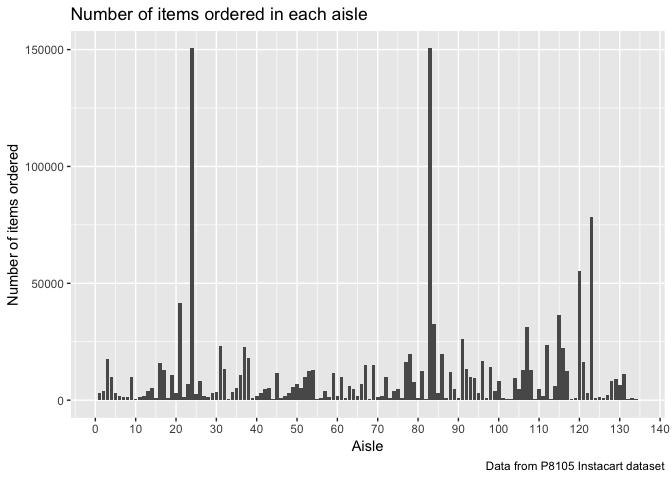

p8105\_hw3\_tm2680
================
Tatini Mal-Sarkar
10/4/2018

Problem 1
=========

``` r
brfss_data = brfss_smart2010 %>% 
  janitor::clean_names() %>% 
  filter(topic == "Overall Health") %>% 
  select(-class, -topic, -question, -data_value_footnote_symbol:-respid) %>% 
  mutate(response = factor(response, levels = c("Poor", "Fair", "Good", "Very good", "Excellent", ordered = TRUE))) 
```

``` r
brfss_data %>% 
  filter(year == 2002) %>% 
  group_by(locationabbr) %>% 
  summarize(n = n_distinct(geo_location)) %>% 
  filter(n == 7)
```

    ## # A tibble: 3 x 2
    ##   locationabbr     n
    ##   <chr>        <int>
    ## 1 CT               7
    ## 2 FL               7
    ## 3 NC               7

In 2002, Connecticut, Florida, and North Carolina were all observed at 7 distinct locations in the `brfss_data` dataset.

``` r
brfss_data %>% 
  group_by(locationabbr, year) %>% 
  summarize(n = n_distinct(geo_location)) %>% 
  ggplot(aes(x = year, y = n, color = locationabbr)) + 
  geom_line() +
  labs(
    title = "Spaghetti plot",
    x = "Year",
    y = "Number of locations in each state",
    caption = "Data from BRFSS"
  ) +
  scale_color_hue(name = "State")
```


Here is my spaghetti plot showing the number of locations across time for the `brfss_data` dataset. The colors correspond to state, and the data is from 2002 to 2010.

``` r
brfss_data %>% 
  filter(locationabbr == "NY") %>% 
  group_by(year) %>% 
  spread(response, data_value) %>% 
  janitor::clean_names() %>% 
  filter(year == 2002 | year == 2006 | year == 2010) %>% 
  summarize(mean_exc = mean(excellent, na.rm = TRUE),
            sd_exc = sd(excellent, na.rm = TRUE)) %>% 
  knitr::kable()
```

|  year|  mean\_exc|   sd\_exc|
|-----:|----------:|---------:|
|  2002|   24.04000|  4.486424|
|  2006|   22.53333|  4.000833|
|  2010|   22.70000|  3.567212|

This is my table that shows the mean and standard deviation for the proportion of "Excellent" responses across all locations in New York for the years 2002, 2006, and 2010.

``` r
brfss_data %>% 
  group_by(year, locationabbr) %>% 
  spread(response, data_value) %>% 
  janitor::clean_names() %>% 
  summarize(mean_exc = mean(excellent, na.rm = TRUE),
            mean_vgood = mean(very_good, na.rm = TRUE),
            mean_good = mean(good, na.rm = TRUE),
            mean_fair = mean(fair, na.rm = TRUE),
            mean_poor = mean(poor, na.rm = TRUE)) %>% 
  gather(response, means, mean_exc:mean_poor) %>% 
  ggplot(aes(x = year, y = means, color = locationabbr)) +
  geom_line() + 
  facet_grid( ~ response) +
  scale_color_hue(name = "State") + 
  theme(axis.text.x = element_text(angle = 90))
```


Here is my 5-panel plot of distribution of state-level averages of the response types over time.

Problem 2
=========

The `instacart` dataset contains 1384617 observations and 15 variables. These variables describe orders from Instacart, a grocery service. For instance, `aisle` (e.g. fresh fruits) and `department` (e.g. canned goods) refer to the aisle and department the specific product within that order comes from. Every product from each order is listed as its own observation. For example, `order_id` 1 has 8 observations, related to 8 different products. We assume that `order_dow` = 6 corresponds to Sunday.

``` r
instacart %>% 
  janitor::clean_names() %>%
  group_by(aisle_id) %>% 
  summarize(n_aisle = n()) %>% 
  filter(min_rank(desc(n_aisle)) < 2)
```

    ## # A tibble: 1 x 2
    ##   aisle_id n_aisle
    ##      <int>   <int>
    ## 1       83  150609

The `instacart` dataset contains 134 aisles. The aisle with the most items ordered was aisle 83.

``` r
instacart %>% 
  janitor::clean_names() %>% 
  group_by(aisle_id) %>% 
  summarize(number_of_items = n()) %>%
  ggplot(aes(x = aisle_id, y = number_of_items)) + 
  geom_bar(stat = "identity") +
  labs(
    title = "Number of items ordered in each aisle",
    x = "Aisle",
    y = "Number of items ordered",
    caption = "Data from P8105 Instacart dataset"
  ) +
  scale_x_continuous(breaks = c(0, 10, 20, 30, 40, 50, 60, 70, 80, 90, 100, 110, 120, 130, 140),
                     labels = c("0", "10", "20", "30", "40", "50", "60", "70", "80", "90", "100", "110", "120", "130", "140")) +
  theme(legend.position = "bottom")
```



Here is my plot of how many items are getting ordered in each aisle. It is a bar chart to appropriately and legibly show the relationship between aisle and items ordered.

``` r
instacart %>% 
  janitor::clean_names() %>% 
  filter(aisle == "baking ingredients" | aisle == "dog food care" | aisle == "packaged vegetables fruits") %>% 
  group_by(aisle, product_name) %>% 
  summarize(n_prod_ord = n()) %>% 
  filter(min_rank(desc(n_prod_ord)) < 2) %>% 
  select(-n_prod_ord) %>% 
  knitr::kable()
```

| aisle                      | product\_name                                 |
|:---------------------------|:----------------------------------------------|
| baking ingredients         | Light Brown Sugar                             |
| dog food care              | Snack Sticks Chicken & Rice Recipe Dog Treats |
| packaged vegetables fruits | Organic Baby Spinach                          |

Here is my table that shows the most popular item in each of the following aisles.

``` r
instacart %>% 
  filter(product_name == "Pink Lady Apples" | product_name == "Coffee Ice Cream") %>% 
  group_by(product_name, order_dow) %>% 
  summarize(mean_hour = mean(order_hour_of_day)) %>% 
  mutate(order_dow = order_dow + 1,
    day = lubridate::wday(order_dow, label = TRUE, abbr = TRUE, week_start = getOption("lubridate.week.start", 7)),
    hour = lubridate::hour(date_decimal(mean_hour)),
    hour = format(strptime(hour, format = "%H"), "%I %p")) %>% 
  select(-order_dow, -mean_hour) %>% 
  spread(day, hour) %>% 
  knitr::kable()
```

| product\_name    | Sun   | Mon   | Tue   | Wed   | Thu   | Fri   | Sat   |
|:-----------------|:------|:------|:------|:------|:------|:------|:------|
| Coffee Ice Cream | 01 PM | 06 AM | 01 AM | 03 AM | 08 AM | 07 AM | 04 AM |
| Pink Lady Apples | 12 AM | 09 AM | 06 AM | 06 AM | 09 AM | 01 AM | 04 AM |

Problem 3
=========

The `ny_noaa` dataset contains 2595176 observations and 7 variables. Each observation refers to a specific day at a specific location and provides data such as precipitation (`prcp`), snowfall (`snow`), and temperatures (maximum temperature is `tmax`; minimum temperature is `tmin`). Quite a bit of data is missing. Variable `prcp` contains 145838 missing values. Variable `snow` contains 381221 missing values. Variable `snwd` contains 591786 missing values. Variable `tmax` contains 1134358 missing values. Variable `tmin` contains 1134420 missing values.

``` r
noaa_clean = ny_noaa %>% 
  janitor::clean_names() %>% 
  mutate(tmin = as.numeric(tmin),
         tmax = as.numeric(tmax)) %>% 
  mutate(tmin = tmin / 10,
         tmax = tmax / 10,
         prcp = prcp / 10) %>% 
  mutate(year = lubridate::year(date),
         month = lubridate::month(date),
         day = lubridate::mday(date)) 
```

I made new variables for year, month, and day. Temperatures were provided in tenths of Celsius, which did not seem reasonable, so I converted `tmin` and `tmax` to Celsius. Precipitation was in tenths of millimeters, so I converted `prcp` to millimeters.

``` r
noaa_clean %>% 
  group_by(snow) %>% 
  summarize(common_snow = n()) %>% 
  filter(min_rank(desc(common_snow)) < 4) 
```

    ## # A tibble: 3 x 2
    ##    snow common_snow
    ##   <int>       <int>
    ## 1     0     2008508
    ## 2    25       31022
    ## 3    NA      381221

The most commonly observed values are 0mm, 25mm, and NA. NA is popular because there are a lot of missing entries. 0mm and 25mm are still quite low amounts of snowfall, but represent 0in and 1in in the metric system.

``` r
noaa_clean %>% 
  filter(month == 1 | month == 7) %>% 
  group_by(month, year, id) %>% 
  summarize(mean_tmax = mean(tmax), na.rm = TRUE) %>% 
  ggplot(aes(x = year, y = mean_tmax)) + 
  geom_point(alpha = 0.5) + 
  geom_smooth() +
  facet_grid( ~ month) +
  labs(
    title = "Average max temperature",
    x = "Year",
    y = "Mean max temperature (Celsius)",
    caption = "Data from NY NOAA dataset. 1 is January. 7 is July."
  )
```

    ## `geom_smooth()` using method = 'gam' and formula 'y ~ s(x, bs = "cs")'

    ## Warning: Removed 7058 rows containing non-finite values (stat_smooth).

    ## Warning: Removed 7058 rows containing missing values (geom_point).


Here is my plot showing average max temperature across years. Average max temperatures seem higher in July than January, which seems logical. There are some low outliers in both panels.

``` r
tmax_tmin_p = ggplot(noaa_clean, aes(x = tmin, y = tmax)) +
  geom_hex() +
  theme(legend.position = "bottom") +
  labs(
    x = "Minimum temperature (Celsius)",
    y = "Maximum temperature (Celsius)"
  )

snow_dist_p = noaa_clean %>% 
  filter(0 < snow & snow < 100) %>% 
  mutate(year = as.character(year)) %>% 
  ggplot(aes(x = snow, y = year)) +
  geom_density_ridges(scale = 0.85) +
  labs(
    x = "Snow (mm)",
    y = "Year"
  )

(tmax_tmin_p + snow_dist_p)
```

    ## Warning: Removed 1136276 rows containing non-finite values (stat_binhex).

    ## Picking joint bandwidth of 3.76


Here is my 2-panel plot. Panel 1 shows a hexplot of `tmax` versus `tmin` with all the data. Panel 2 uses a ridge plot to show the distribution of `snow` between 0 and 100 mm by `year`.
